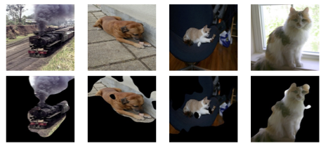
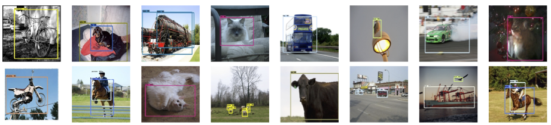

# Ventral-Dorsal Neural Networks: Object Detection via Selective Attention
Brain Inspirations: 
There is much evidence that the human visual system is equipped with a useful spatial selective attention capability that guides processing to relevant parts of the scene while effectively ignoring irrelevant parts. Some theories of spatial attention focus on divergent but interacting neural pathways in the brain’s visual system. Projecting from primary visual cortex in the occipital lobe, two neural streams emerge, as the following image. One stream, extending ventrally into the temporal lobe, appears to largely encode what is in the scene, recognizing objects. The other stream, passing dorsally into the parietal lobe, approximately captures information about where objects are located. Some computational neuroscience accounts characterize spatial attention as naturally arising from interac- tions between these two neural pathways. Inspired by this theory of attention, we propose a novel object detection framework that integrates two networks that reflect the two pathways of the human visual system. The Ventral Net uses object classification information to guide attention to rele- vant image regions, and the Dorsal Net uses this attentional information to accurately localize and identify objects in the scene. Together, these two components form a Ventral- Dorsal Neural Network (VDNet).

Ventral-Dorsal Framework for Object Detection:

Selective Attention:

Some Results on PASCAL VOC 2007 Dataset:

